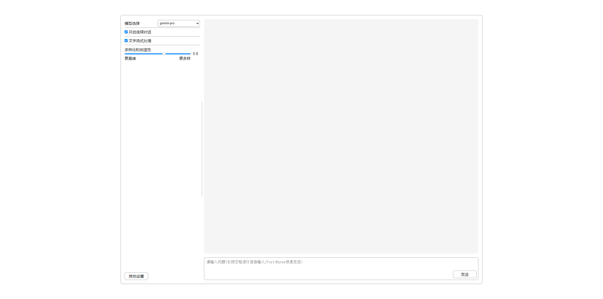
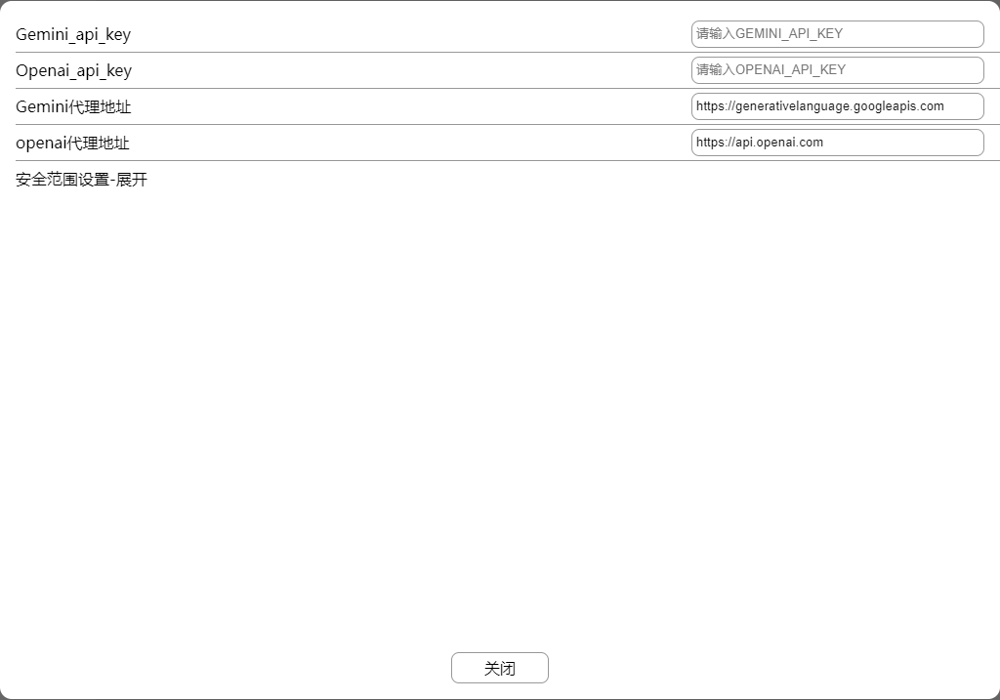

# Simple-Gemini-UI

简易的 Gemini 的 UI 界面

## 纯静态的 HTML 无需打包

1. 把 src 文件夹下的所有文件部署在服务器上
2. 打开页面，点击其他设置添加 Gemini 的 API_KEY
3. 可以开始使用了

## 支持的功能

1. 模型选择（gemini-pro/gemini-pro-version）
2. 连续对话
3. 请求流式处理
4. 多样化和创造性设置
5. 安全范围设置 （未经测试）
6. _gemini-pro-version_ 选择图片
7. _gemini-pro-version_ 使用摄像头
8. 如果有 openai_api_key 还可以使用语音输入

_如果你有自己的代理，可以填入自己的代理地址方便正常环境访问（gemini/openai 都可以设置代理地址）_

### 主界面

### 其他设置

